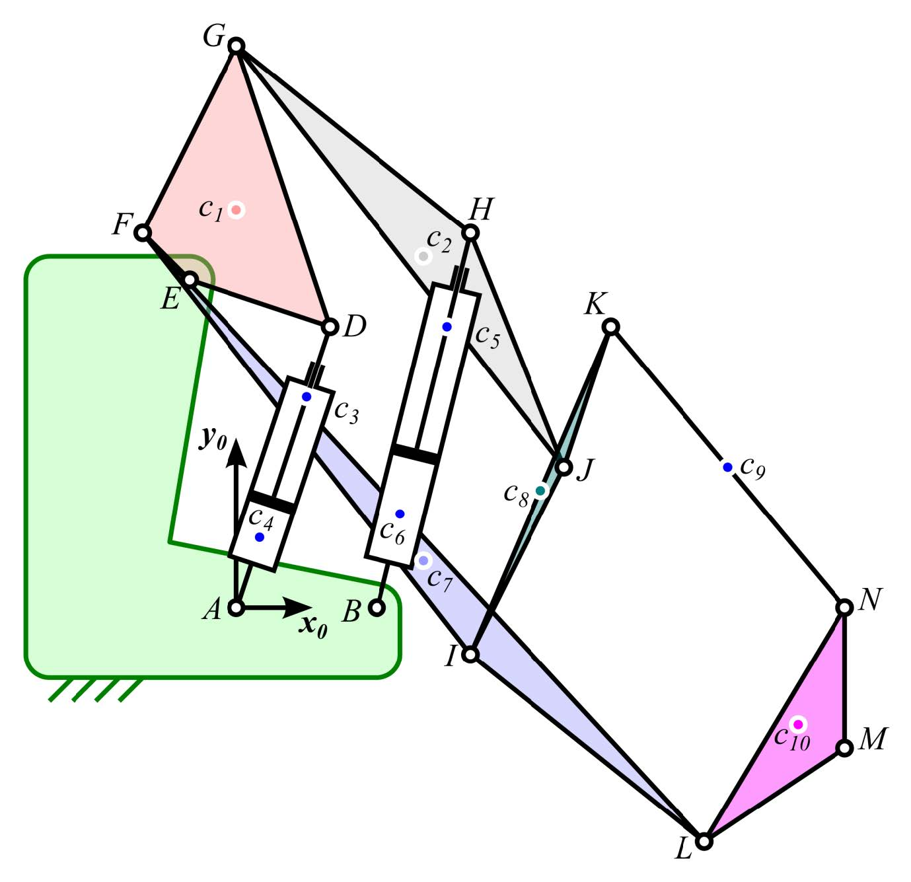
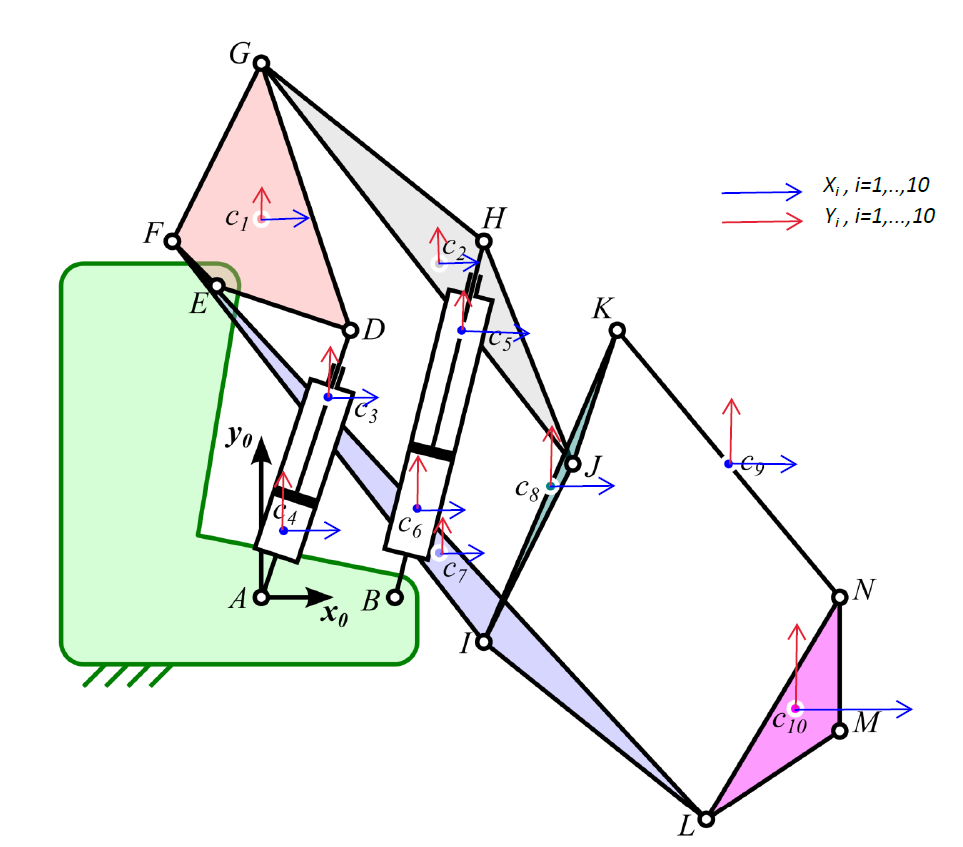
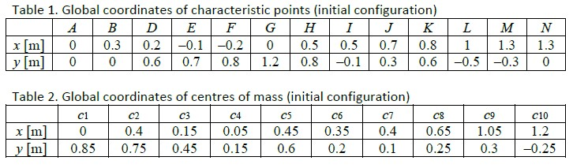
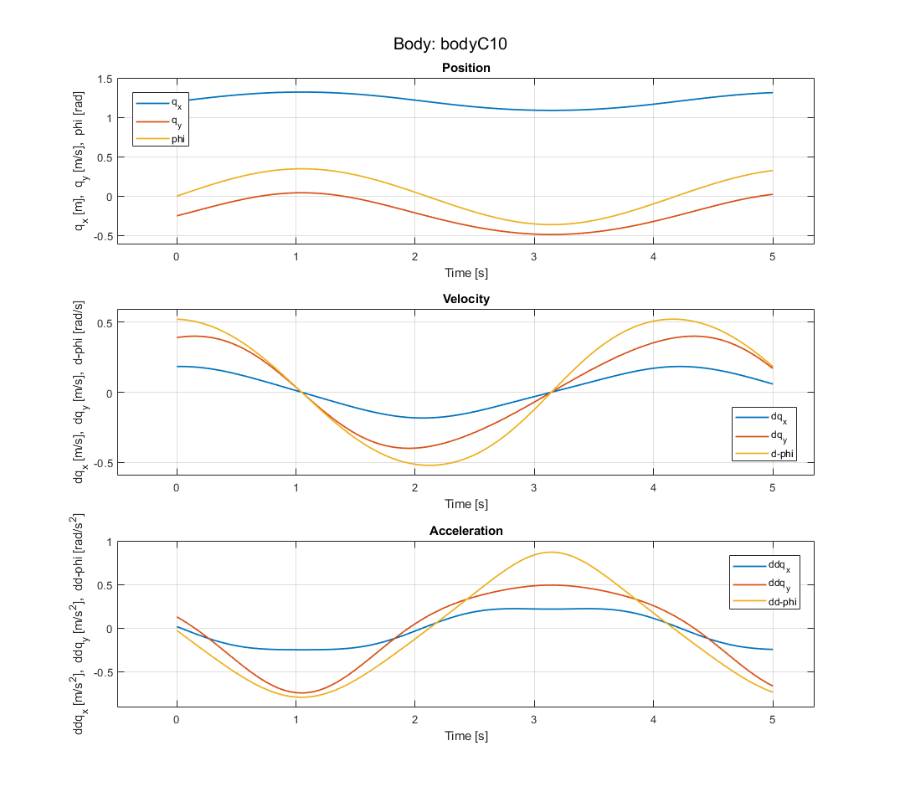
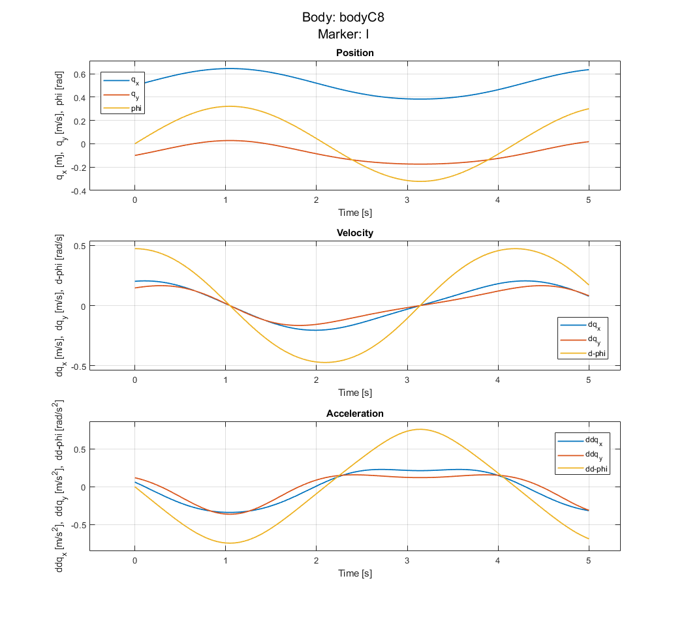
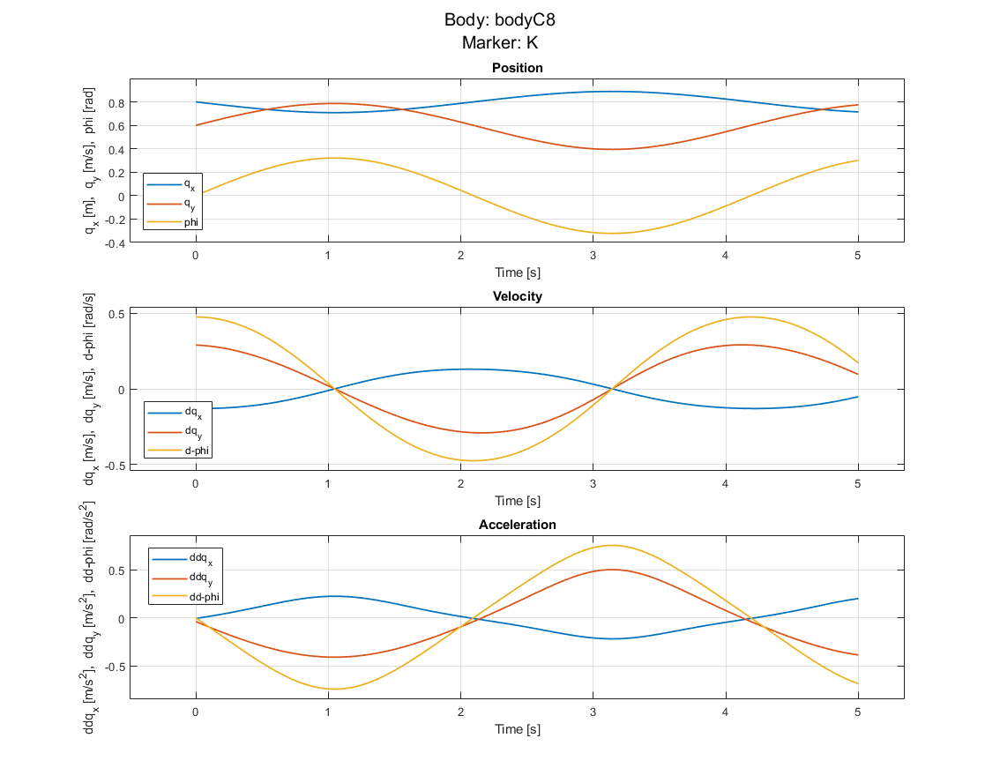

# kinematics-of-multi-body-system

Implementation of a general planar mechanism kinematics analysis tool using absolute coordinates in MATLAB.

## Table of Contents

- [Usage](#usage)
- [License](#license)
- [Contributing](#contributing)

## Usage

To use this project, the mechanism must be defined in a specified way as demonstrated in the example below.
The full detail of the example mechanism can be found in the directory `/src/preprocessor`. 

To define the mechanism, a MATLAB struct is used. The definition follows the pattern:
`mechanismName.bodyName.bodyProperties`

`bodyProperty` includes:

- the location of its center of mass,
- joints that are associated with the body and their properties which include:
  - Joint location (if the type is `P`, the location can be just `[NaN, NaN]'`)
  - Joint type either `P` for translational or `R` for revolute
  - Logical variable `driving` to indicate if there is a driving constraint associated with the joint
  - If `driving` is `true`, specify the motion as an anonymous function of time, `fAB`
  - Special Case: if the joint is translational and if it is directly connected to the ground, a reference point must be provided to define the axis of translation accurately.
- Initial values of the kinematic variable (position `q0`, velocity `dq`, and acceleration `ddq`)
- Marker points for which kinematic analysis is to be performed
  - Marker points on a body named `bodyName` is defined as: `bodyName.markers.markerName.Location`. Then assign the location.

### Example

Mechanism and assignement of absolute coordinates (it doesn't matter where the coordinates are assigned on the bodies; however, for convenience they are put at each CoM):
<div style="display: flex; justify-content: space-between;">
    
    
</div>

Coordinates of bodies CoM and joints: 


Example of defining mechanism and its ground
```matlab
mechanism = struct();
% Ground: center of mass and initial values of the kinematic variables
% These are fixed since the ground doesn't move.
mechanism.ground.com = [0, 0]';
mechanism.ground.q0 = [0, 0, 0]';
mechanism.ground.dq = [0, 0, 0]';
mechanism.ground.ddq = [0, 0, 0]';
```

Example of defining a body:
```matlab
% Plate C3: center of mass and initial values
mechanism.bodyC3.com = [0.15, 0.45]';
mechanism.bodyC3.q0 = [0.15, 0.45, 0]';
mechanism.bodyC3.dq = [0, 0, 0]';
mechanism.bodyC3.ddq = [0, 0, 0]';
```
Example of defining a joint without driving:
```matlab
mechanism.bodyC3.joints.joint_D.type = 'R';
mechanism.bodyC3.joints.joint_D.location = [0.2, 0.6]';
mechanism.bodyC3.joints.joint_D.driving = false;
```
Example of defining a joint with driving:
```matlab
mechanism.bodyC3.joints.joint_AD.type = 'P';
mechanism.bodyC3.joints.joint_AD.location = [NaN, NaN]';
mechanism.bodyC3.joints.joint_AD.driving = true;
mechanism.bodyC3.joints.joint_AD.fAB = @(t) -0.1*sin(1.5*t+0);  % Specify motion
```
Special Case: Defining translational joint on the ground:
```matlab
mechanism.ground.joints.jointD.type = 'P';
mechanism.ground.joints.jointD.location = [NaN, NaN]';
mechanism.ground.joints.jointD.driving = false;
% Put a reference for defining the translational axis
mechanism.ground.joints.jointD.reference = [5, 4]';
```

Example of defining a marker point on a body
```matlab
% Markers associated with bodyC3
mechanism.bodyC3.markers.D.location = [0.2, 0.6]';
```

### Performing analysis
- Add files to the MATLAB PATH
```matlab
% Initialize the system by adding all files to the MATLAB PATH
Initialize;
```
- get the mechanism definition
```matlab
% Get the mechanism for which kinematics analysis is to be performed
mechanism = defineMechanism;
```

- Perform kinematic analysis for bodies of the mechanism
```matlab
%% Kinematics analysis
% solve the kinematic problem for the mechanism bodies and their marker
% points.
endTime = 5;
steps = 100;
kinematics = Kinematics(mechanism, endTime, steps);
```

### Visualization 
To visualize bodies kinematics analysis result specify the option `'b'` or `'B'` for markers specify option `'m'` or `'M'`. 
This will generate a plot of position, velocity and acceleration of each specified body/markers in the mechanism respectively.

```matlab
%% Visualization
% To generate plot of kinematics result analysis for the entire 
% bodies or markers in the mechanism use: 

% Visualizer(markersKinematics, 'b')
% Visualizer(markersKinematics, 'm')

% Or we can specify the body name of interest
bodyNames = {'bodyC1', 'bodyC10'};
Visualizer(kinematics, 'b', bodyNames)

% The same thing for markers as well
bodyNames = {'bodyC8'};
markerNames = {'K', 'I'};
Visualizer(kinematics, 'm', bodyNames, markerNames)

```

- Bodies Kinematics:
<div style="display: flex; justify-content: space-between;">
    
    
</div>


- Marker Points Kinematics:
<div style="display: flex; justify-content: space-between;">
    
    
</div>

## License
[](LICENSE)


